# repo-diagram.md

## Repository relationship map

This diagram shows how the main repo documents, memory files, skill assets, and Outlook integration work relate to each other.

```mermaid
graph TD
    classDef root fill:#1f2937,stroke:#111827,color:#f9fafb,stroke-width:2px;
    classDef identity fill:#7c3aed,stroke:#4c1d95,color:#ffffff,stroke-width:2px;
    classDef memory fill:#0f766e,stroke:#134e4a,color:#ffffff,stroke-width:2px;
    classDef security fill:#b45309,stroke:#78350f,color:#ffffff,stroke-width:2px;
    classDef skill fill:#2563eb,stroke:#1e3a8a,color:#ffffff,stroke-width:2px;
    classDef spec fill:#059669,stroke:#064e3b,color:#ffffff,stroke-width:2px;
    classDef plugin fill:#dc2626,stroke:#7f1d1d,color:#ffffff,stroke-width:2px;
    classDef leaf fill:#f8fafc,stroke:#94a3b8,color:#0f172a,stroke-width:1px;

    A[Luna Repo Root]

    subgraph Core Identity and Operating Rules
        B[AGENTS.md]
        C[SOUL.md]
        D[USER.md]
    end

    subgraph Memory and Continuity
        E[MEMORY.md]
        F[memory/2026-03-23.md]
    end

    subgraph Security and Platform Notes
        G[security-notes.md]
    end

    subgraph Outlook Skill Layer
        H[outlook-mail-assistant/]
        H1[SKILL.md]
        H2[references/attachment-parsing-guide.md]
        H3[references/outlook-plugin-design.md]
        H4[scripts/parse_attachment.py]
    end

    subgraph Outlook Plugin Design Layer
        I[outlook-graph-plugin-spec/]
        I1[README.md]
        I2[SKILL.md]
        I3[references/config-schema-outline.md]
        I4[references/tool-contracts.md]
        I5[references/threat-model.md]
        I6[references/microsoft-graph-implementation-plan.md]
        I7[references/oauth-setup-checklist.md]
    end

    subgraph Local Plugin Implementation Layer
        J[.openclaw/extensions/outlook-graph/]
        J1[openclaw.plugin.json]
        J2[package.json]
        J3[src/index.ts]
        J4[src/config.ts]
        J5[src/policy.ts]
        J6[src/auth/oauth.ts]
        J7[src/auth/token-store.ts]
        J8[src/graph/client.ts]
        J9[src/graph/mail-folders.ts]
        J10[src/graph/messages.ts]
        J11[src/graph/attachments.ts]
        J12[src/tools/list-folders.ts]
        J13[src/tools/search-messages.ts]
        J14[src/tools/get-message.ts]
        J15[src/tools/get-thread.ts]
        J16[src/tools/download-attachment.ts]
        J17[src/tools/create-draft.ts]
        J18[src/tools/update-draft.ts]
    end

    A --> B
    A --> C
    A --> D
    A --> E
    A --> F
    A --> G
    A --> H
    A --> I
    A --> J

    B --> D
    B --> E
    D --> E
    F --> E

    H --> H1
    H --> H2
    H --> H3
    H --> H4

    I --> I1
    I --> I2
    I --> I3
    I --> I4
    I --> I5
    I --> I6
    I --> I7

    J --> J1
    J --> J2
    J --> J3
    J --> J4
    J --> J5
    J --> J6
    J --> J7
    J --> J8
    J --> J9
    J --> J10
    J --> J11
    J --> J12
    J --> J13
    J --> J14
    J --> J15
    J --> J16
    J --> J17
    J --> J18

    H3 --> I
    I --> J
    D --> J
    E --> J
    G --> J

    class A root;
    class B,C,D identity;
    class E,F memory;
    class G security;
    class H,H1,H2,H3,H4 skill;
    class I,I1,I2,I3,I4,I5,I6,I7 spec;
    class J,J1,J2,J3,J4,J5,J6,J7,J8,J9,J10,J11,J12,J13,J14,J15,J16,J17,J18 plugin;
```

## Color legend

- **Purple** → identity, persona, and user operating rules
- **Teal** → memory and continuity
- **Amber** → security and platform notes
- **Blue** → skill layer
- **Green** → plugin design/spec layer
- **Red** → local implementation layer

## Outlook workstream relationships

### 1. User policy and memory
- `USER.md` stores working preferences and current operating rules
- `MEMORY.md` stores durable long-term rules and decisions
- `memory/2026-03-23.md` stores the detailed daily log of Outlook integration decisions and reviews

### 2. Outlook mail skill
- `outlook-mail-assistant/` is the higher-level skill for analyzing email content and attachments
- it is useful for manual analysis and draft generation
- it is **not** the real-time mailbox integration itself

### 3. Outlook plugin design layer
- `outlook-graph-plugin-spec/` defines the intended plugin behavior
- this includes:
  - threat model
  - tool contracts
  - config outline
  - OAuth checklist
  - Microsoft Graph implementation plan

### 4. Local plugin implementation layer
- `.openclaw/extensions/outlook-graph/` is the actual local native plugin scaffold
- it is the implementation candidate for the design in `outlook-graph-plugin-spec/`
- it currently contains:
  - manifest
  - config schema
  - policy guardrails
  - auth/token stubs
  - Graph client code
  - phase-1 tools for approved Outlook actions

### 5. Security and platform context
- `security-notes.md` records the OpenClaw hardening decisions already applied on the machine
- those security decisions matter because Outlook integration is a high-trust capability and should stay aligned with the repo’s safer operating posture

## Current state summary

- policy exists
- design exists
- local plugin scaffold exists
- OAuth connect flow is incomplete
- runtime validation is incomplete
- live Outlook access is **not finished yet**
